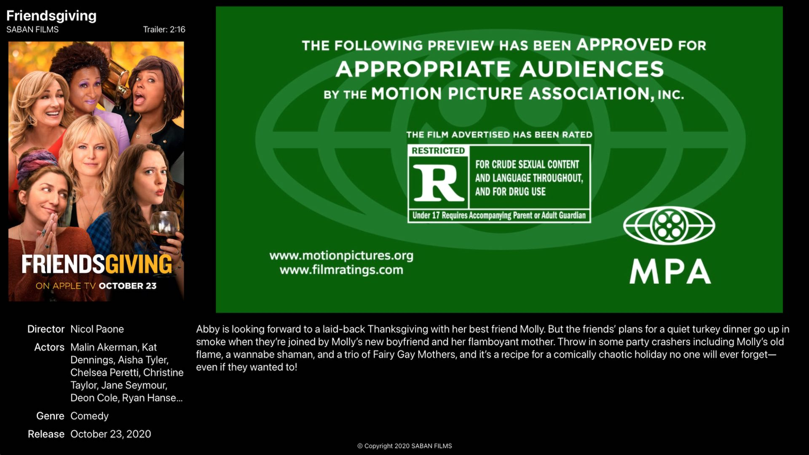

# Front Row Trailers
Free iOS & macOS app written in SwiftUI that provides a nice movie trailer watching experience on iPhone, iPad, and Mac, plus via AirPlay to Apple TV and AirPlay 2-compatible TVs. Front Row Trailers is [available on the App Store](https://apps.apple.com/app/id1534845010).

## Screenshots (iOS)

On device:  

On TV (via AirPlay or adapter):  

## Screenshot (macOS)

## Installation

The latest release version of this app is [available on the App Store](https://apps.apple.com/app/id1534845010) and beta versions are sometimes available on [TestFlight](https://testflight.apple.com/join/Wnlesgzr). It appears on your homescreen as "Front Row".  

To build from source, you need Xcode 12 and an Apple Developer account. Clone or download the repository, open the Xcode project and change the bunde identifier and development team. Then build and run.

## Use

The app presents a list of the latest movie trailers available from the iTunes Movie Trailers XML API.  
Tap on the Play button to start the trailer.

When an external screen is connected, the device displays only the poster artwork and play/pause button. The trailer video and related information for the now playing movie trailer is shown on the connected (AirPlay) screen.

## How to connect to a TV or external screen

On a real iOS device: use AirPlay Mirroring from Control Center or connect directly via a compatible adapter.

In the iOS Simulator: Click "I/O" in the menu bar, then choose any resolution under "External Displays".

## Version History 

The project was first made available on the App Store in November 2020 as "Theatrical Trailers". The app received several updates throughout 2021, adding iOS Widgets, telemetry, iPad pointer support, an AirPlay screensaver, and interaction sounds.  

In January of 2022, work began to port the app to Mac. The iOS version ran very poorly on Apple Silicon Macs and had therefore not been available on the Mac App Store. The native Mac app, designed to replicate the Front Row and Apple TV 1 user experiences, was released in February of 2022 after a short beta testing period. At the same time, the project was renamed to Front Row Trailers, the [website](https://frontrow-trailers.app/) was created, and the app icon was redesigned.

## About the name

The term "Front Row" was trademarked by Apple Inc. for [their media center software](https://en.wikipedia.org/wiki/Front_Row_(software) from 2006 to 2018.  
Apple Inc. is not affiliated with the creators of Front Row Trailers, apart from distribution on the App Store.  

## Contributing

Please feel free to submit a pull request if you would like to contribute to this project.   
The author does not actively monitor issues.  

## Privacy

This app does not collect any personally identifiable information. See the [Privacy Policy](https://frontrow-trailers.app/privacypolicy/) for details.

## Copyright

See [License](LICENSE) for details about the **source code** license, which covers the website (/docs) as well.

The Front Row Trailers app icons are © 2022 Christoph Parstorfer. All rights reserved.

Two XML files from iTunes Movie Trailers are included with the project for reference and educational purposes. The [License](LICENSE) does not cover these XML files.
Four AIFF files from [Apple Front Row](https://en.wikipedia.org/wiki/Front_Row_(software)) are included with the project. These files are also not covered by the [License](LICENSE).

The [Front Row Trailers website](https://frontrow-trailers.app/) is based on the ["Automatic App Landing Page" theme](https://github.com/emilbaehr/automatic-app-landing-page) by [emilbaehr](https://github.com/emilbaehr).

The Apple Logo, AirPlay, iOS and iTunes are trademarks of Apple Inc., registered in the U.S. and other countries.  
FRIENDSGIVING is © 2020 SABAN FILMS.  
All My Life is © 2020 Universal Pictures.  
