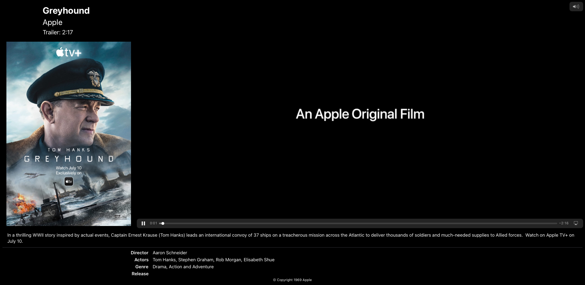

# TheatricalMovieTrailers
iOS 14 app written in SwiftUI that provides a nice trailer watching experience via AirPlay.

## Screenshots

On device, with TV connected:  

On TV:  

## Use

The app presents a list of movie trailers using the iTunes Movie Trailers XML API.  
Tap on the Play button to start the trailer.

When an external screen is connected, the device displays only the poster artwork and play/pause button. The trailer video and related information for the last selected movie is shown on the connected screen.

## How to connect to a TV or external screen

On a real iOS device: use AirPlay Mirroring from Control Center or connect directly via a compatible adapter.

In the iOS Simulator: Click "I/O" in the menu bar, then choose any resolution under "External Displays".

## Contributing

Please feel free to submit a pull request if you would like to contribute to this project.   
The author does not actively monitor issues.  

## Copyright

See [License](LICENSE) for details about the source code license.

Two XML files from iTunes Movie Trailers are included with the project for reference and educational purposes. The [License](LICENSE) does not cover these XML files.

The Apple Logo, AirPlay, iOS, and iTunes are trademarks of Apple Inc., registered in the U.S. and other countries.  
Greyhound is © Copyright 1969-2020 Apple.
